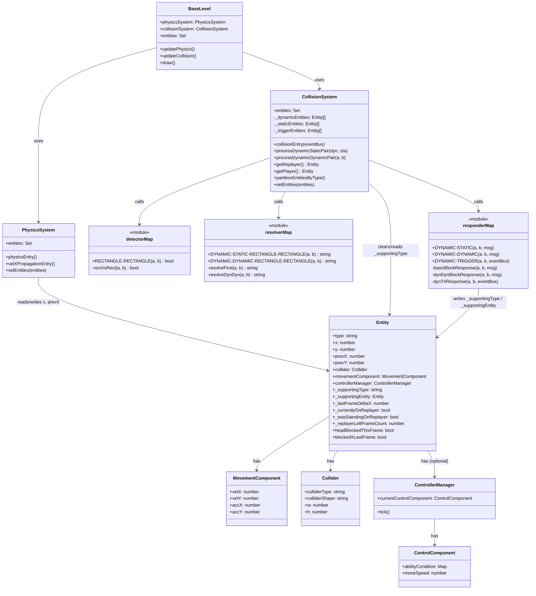
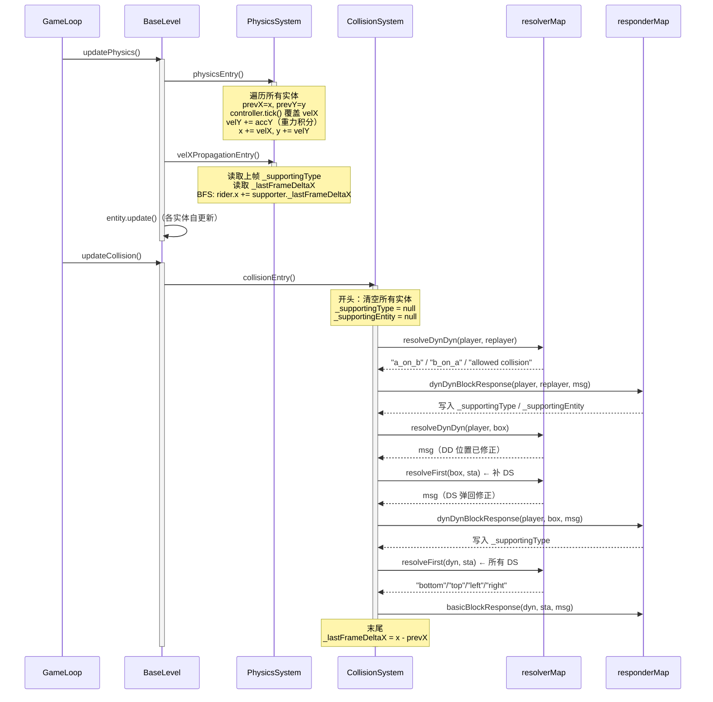
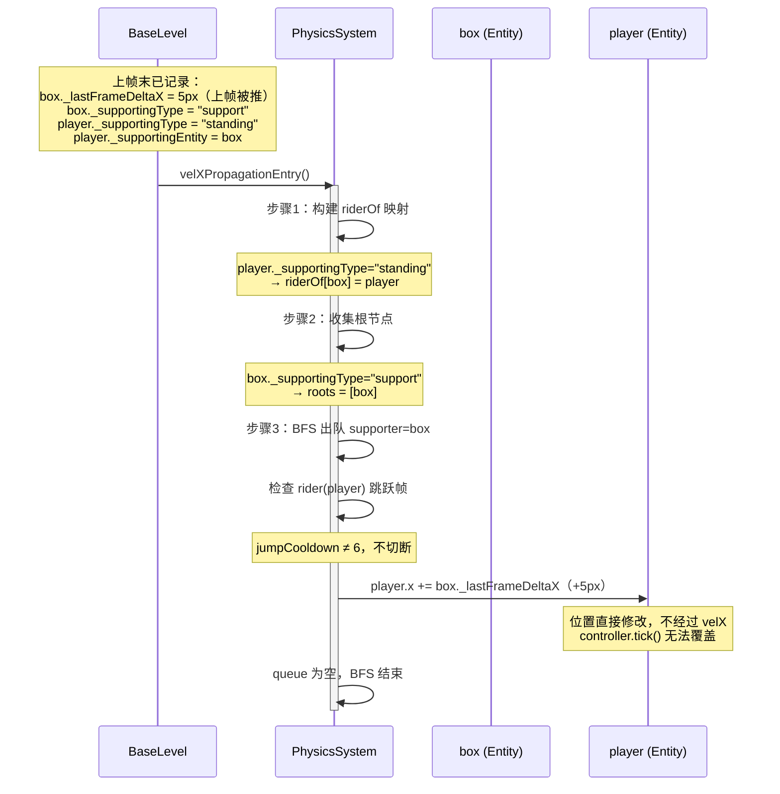
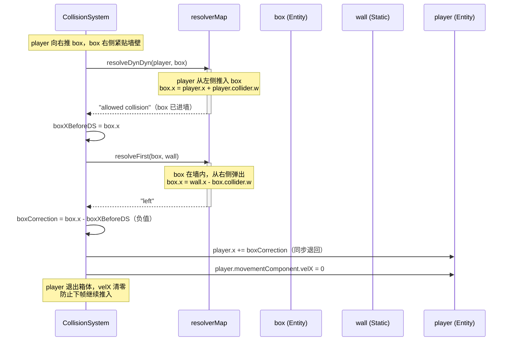

# 堆叠物理系统技术文档

> 适用版本：当前 Angelica 项目主干
> 涉及文件：`PhysicsSystem.js`、`CollisionSystem.js`、`resolverMap.js`、`responderMap.js`、`detectorMap.js`、`BaseLevel.js`

---

## 1. 系统概述

### 1.1 设计目标

堆叠系统负责解决以下问题：

- **垂直跟随**：当实体 A 站在移动实体 B 上时，A 随 B 的水平位移同步移动，视觉上不发生滑动。
- **链式传递**：支持多层堆叠（如 player 站在 boxA 上，boxA 被 replayer 推动），位移沿链自底向上传递。
- **跳跃解耦**：实体在跳跃起飞帧不继承支撑者的位移，避免与跳跃速度叠加。
- **落地速度正常**：实体从动态支撑者边缘离开时，垂直速度从自然重力起步，不爆发。

### 1.2 支持的堆叠关系

| 上层实体（rider） | 下层实体（supporter） | 说明                       |
| ----------------- | --------------------- | -------------------------- |
| player            | box                   | 玩家站在箱子上             |
| player            | replayer              | 玩家站在回放分身上         |
| replayer          | player                | 分身站在玩家头上           |
| replayer          | box                   | 分身站在箱子上             |
| box               | box                   | 箱子叠箱子                 |
| box               | player / replayer     | 箱子被顶推（pushing 关系） |
| 任意 DYNAMIC      | 任意 DYNAMIC          | 通用兜底分支（generic DD） |

> **静态平台不参与堆叠系统**。静态地面碰撞由 `basicBlockResponse` 处理，不写入 `_supportingType`。

### 1.3 整体架构思路

堆叠系统横跨三个子系统，各司其职：

```
PhysicsSystem          CollisionSystem         PhysicsSystem
  physicsEntry()    →    collisionEntry()    →  velXPropagationEntry()
  （积分、控制输入）    （碰撞检测+写关系）       （BFS传播水平位移）
```

核心设计决策：

1. **位移记录而非速度记录**：箱子被推动时 `velX` 始终为 0（DD resolver 直接改 `x`），因此在 `collisionEntry()` 末尾记录 `_lastFrameDeltaX = x - prevX`，用真实位移量替代速度。
2. **直接修改 `x` 而非 `velX`**：controller 每帧在 `physicsEntry()` 内部覆盖 `velX = 0`（idle 状态）。若把位移加到 `velX`，下一帧 controller 会清零，永远不生效。直接加到 `rider.x` 则绕过这一覆盖。
3. **BFS 从底向上**：支撑链可以是多层的，BFS 保证每一层都按顺序处理，不遗漏。

---

## 2. 核心数据结构

所有字段挂载在 DYNAMIC 实体对象（entity）上，无需预先声明，由碰撞系统按需写入。

### 2.1 堆叠关系字段

| 字段名              | 类型           | 含义                                               |
| ------------------- | -------------- | -------------------------------------------------- |
| `_supportingEntity` | Entity \| null | 本实体的直接支撑者（下方的那个实体）               |
| `_supportingType`   | string \| null | 本实体在当前堆叠链中的角色（见下表）               |
| `_lastFrameDeltaX`  | number         | 上一帧本实体的真实水平位移（由 `x - prevX` 计算）  |
| `prevX`             | number         | 本帧物理积分前的 x 坐标，用于碰撞判断和 delta 计算 |
| `prevY`             | number         | 本帧物理积分前的 y 坐标，用于碰撞判断              |

### 2.2 `_supportingType` 取值说明

| 值           | 含义                                                                                 |
| ------------ | ------------------------------------------------------------------------------------ |
| `null`       | 未处于任何堆叠关系（在空中，或站在静态地面上）                                       |
| `"standing"` | 本实体站在 `_supportingEntity` 上方，是 rider（上层）                                |
| `"support"`  | 本实体是链的底层支撑者，有 rider 站在它头上；自身不被任何人支撑                      |
| `"pushing"`  | 本实体正在顶推另一个实体（`_supportingEntity` 是被顶在上面的那个）；自身是水平施力方 |

### 2.3 字段生命周期

```
帧开始
  │
  ├─ physicsEntry() 内
  │    prevX = x, prevY = y       ← 快照，用于本帧碰撞方向判断
  │    controller.tick()          ← 可能覆盖 velX
  │    x += velX, y += velY       ← 位置积分
  │
  ├─ velXPropagationEntry() 内
  │    读取 _supportingType / _supportingEntity（上帧末写入）
  │    读取 _lastFrameDeltaX（上帧末写入）
  │    直接修改 rider.x
  │
  ├─ collisionEntry() 内 — 开头
  │    _supportingEntity = null   ← 清空，由本帧碰撞重新建立
  │    _supportingType   = null   ← 清空
  │
  ├─ collisionEntry() 内 — 中段（responderMap 回调）
  │    _supportingEntity = b      ← 按本帧碰撞结果写入
  │    _supportingType   = "standing" / "support" / "pushing"
  │
  └─ collisionEntry() 内 — 末尾
       _lastFrameDeltaX = x - prevX  ← 记录本帧真实位移，供下帧 BFS 使用
帧结束
```

---

## 3. 每帧执行流程

### 3.1 完整帧顺序（`BaseLevel.js` 160–189 行）

```
updatePhysics()                             updateCollision()
  │                                           │
  ├─ 1. physicsSystem.physicsEntry()          ├─ 4. collisionSystem.collisionEntry()
  │      每个有 movementComponent 的实体：           ├─ 清空 _supportingType / _supportingEntity
  │        - entity.prevX = entity.x                ├─ 2-pass: player-replayer DD + 所有 DS
  │        - entity.prevY = entity.y                ├─ player-replayer 第三次 DD（保证无重叠）
  │        - controller.tick() → 更新 velX          ├─ player vs enemy DD
  │        - velY += accY（重力积分）                ├─ player vs box DD（附带 DS 补正）
  │        - x += velX, y += velY                   ├─ replayer vs enemy DD
  │                                                  ├─ replayer vs box DD（附带 DS 补正）
  ├─ 2. physicsSystem.velXPropagationEntry()         ├─ enemy DS
  │      BFS：读取上帧堆叠关系，                     ├─ 按钮 TRIGGER
  │      将 supporter._lastFrameDeltaX               └─ 末尾：_lastFrameDeltaX = x - prevX
  │      直接加到 rider.x
  │
  └─ 3. entity.update()（各实体自更新，如告示牌交互）
```

### 3.2 各阶段职责

| 阶段       | 函数                     | 职责                                         |
| ---------- | ------------------------ | -------------------------------------------- |
| 物理积分   | `physicsEntry()`         | 输入→速度→位置；记录 `prevX/prevY`           |
| 水平传播   | `velXPropagationEntry()` | BFS 读取上帧堆叠关系，将支撑位移加到 rider.x |
| 实体自更新 | `entity.update()`        | 告示牌、动画等逻辑                           |
| 碰撞检测   | `collisionEntry()`       | 检测→修正→写堆叠关系→记录 `_lastFrameDeltaX` |

### 3.3 `velXPropagationEntry` 为何放在物理积分之后、碰撞检测之前

- **必须在 `physicsEntry` 之后**：需要等 `x += velX` 完成，才能通过位移把 rider 带到正确位置。
- **必须在 `collisionEntry` 之前**：碰撞检测需要实体处于"最终位置"（含支撑者的水平位移），才能正确判断是否仍然叠在一起。若 velXPropagation 在碰撞之后运行，rider 会被"传送"到碰撞修正后的位置，当帧渲染已结束，下帧才能看到效果，产生一帧延迟漂移。
- **\_supportingType 读取的是上帧数据**：`collisionEntry` 开头就清空了 `_supportingType`，所以 `velXPropagationEntry` 必须在清空之前运行。两者因此天然不能互换顺序。

---

## 4. 碰撞检测与关系记录

### 4.1 `detectorMap`：判断是否发生碰撞

文件：`js/collision-system/detectorMap.js`

目前只有一种形状对：

```js
"RECTANGLE-RECTANGLE": (a, b) => rectVsRect(a, b)
```

`rectVsRect` 用轴对齐包围盒（AABB）判断，返回 `true/false`，**不判断方向**。方向由 resolver 根据上一帧位置推断。

### 4.2 `resolverMap`：修正位置并返回碰撞消息

文件：`js/collision-system/resolverMap.js`

#### DYNAMIC-STATIC（`resolveFirst`，第 9–92 行）

用 `prevY`/`prevX` 与当前位置做帧穿越检测：

| 条件                                          | 消息       | 修正                                     |
| --------------------------------------------- | ---------- | ---------------------------------------- |
| `prevBottom >= staTop && currBottom < staTop` | `"bottom"` | `a.y = staTop`（落地）                   |
| `prevTop <= staBottom && currTop > staBottom` | `"top"`    | `a.y = staBottom - a.collider.h`（顶头） |
| `prevRight <= staLeft && currRight > staLeft` | `"right"`  | `a.x = staLeft - a.collider.w`（右撞墙） |
| `prevLeft >= staRight && currLeft < staRight` | `"left"`   | `a.x = staRight`（左撞墙）               |
| 兜底（上帧已重叠）                            | 最小重叠轴 | 按最小轴弹出                             |

> 注意 y 轴正方向向下（屏幕坐标系），`prevBottom` 对应实体顶部（较小 y 值），`staTop` 对应平台顶部。

#### DYNAMIC-DYNAMIC（`resolveDynDyn`，第 94–162 行）

| 条件                                     | 消息                  | 修正                                                   |
| ---------------------------------------- | --------------------- | ------------------------------------------------------ |
| `aPrevBottom >= bPrevTop`（A 在 B 上方） | `"a_on_b"`            | 若 A 被顶住：`b.y = a.y - b.h`；否则 `a.y = b.y + b.h` |
| `bPrevBottom >= aPrevTop`（B 在 A 上方） | `"b_on_a"`            | 对称处理                                               |
| A 从左侧推入 box B                       | `"allowed collision"` | `b.x = a.x + a.w`                                      |
| A 从右侧推入 box B                       | `"allowed collision"` | `b.x = a.x - b.w`                                      |
| box A 被 B 从左/右推入                   | `"allowed collision"` | 对称处理                                               |

### 4.3 `responderMap`：写入堆叠关系

文件：`js/collision-system/responderMap.js`

响应器根据碰撞消息写入 `_supportingType`：

#### `player`/`replayer` + `box`（第 177–223 行）

```
a_on_b（player/replayer 踩在 box 上）:
  a._supportingEntity = b
  a._supportingType   = "standing"
  b._supportingEntity = null
  b._supportingType   = "support"

b_on_a（box 被顶在 player/replayer 上，极少见）:
  b._supportingEntity = a
  b._supportingType   = "standing"
  a._supportingEntity = b
  a._supportingType   = "pushing"
```

#### `box` + `box`（第 226–255 行）

```
a_on_b（上方 box 踩在下方 box 上）:
  a._supportingType = "standing", b._supportingType = "support"

b_on_a（b 踩在 a 上）:
  b._supportingType = "standing", a._supportingType = "pushing"
```

#### 通用 DD 兜底（第 257–320 行，包含 player ↔ replayer）

```
a_on_b:
  a._supportingType = "standing", b._supportingType = "support"
  若 b 是 replayer：a._currentlyOnReplayer = true

b_on_a:
  b._supportingType = "standing", a._supportingType = "pushing"
  若 a 是 replayer 且 b 是 player：b._currentlyOnReplayer = true
```

---

## 5. velX 传递机制

### 5.1 BFS 算法完整逻辑（`PhysicsSystem.js` 第 65–132 行）

```
velXPropagationEntry():

  步骤 1 — 构建 riderOf 反向映射：
    for entity in entities:
      if entity._supportingType == "standing":
        riderOf[entity._supportingEntity] = entity   // supporter → rider
      elif entity._supportingType == "pushing":
        riderOf[entity] = entity._supportingEntity   // self → 被顶的 rider

  步骤 2 — 收集根节点（链底层）：
    roots = entities where _supportingType == "support" OR "pushing"

  步骤 3 — BFS 从根向上传播：
    queue = [...roots], visited = Set(roots)
    while queue not empty:
      supporter = queue.shift()
      rider = riderOf[supporter]
      if !rider or rider in visited: continue

      if rider.jumpCooldown == 6: continue  // 跳跃帧切断

      deltaX = supporter._lastFrameDeltaX ?? supporter.movementComponent.velX
      rider.x += deltaX                     // 直接修改位置

      visited.add(rider)
      queue.push(rider)                     // 继续向上传播
```

### 5.2 三种类型的传递规则

| 角色         | 含义                      | 在 BFS 中的作用                                     |
| ------------ | ------------------------- | --------------------------------------------------- |
| `"support"`  | 链底层，有 rider 站在上面 | **根节点**；`_lastFrameDeltaX` 加到 rider.x         |
| `"standing"` | rider，站在 supporter 上  | 被传播的目标；自身也可能是更上层的 supporter        |
| `"pushing"`  | 顶推者（上方有被顶物体）  | **也作根节点**；`_lastFrameDeltaX` 加到被顶物体的 x |

> **注意**：`pushing` 也被纳入根节点。这是因为 player 推着 box 的同时，box 上可能还站着其他实体，那些实体也需要从 box 获得位移传播。

### 5.3 链式传递示例

**场景：replayer 在移动，boxA 站在 replayer 上，boxB 站在 boxA 上，player 站在 boxB 上**

碰撞后堆叠关系：

```
replayer._supportingType = "support"     （链底）
boxA._supportingType     = "standing",   boxA._supportingEntity = replayer
boxB._supportingType     = "standing",   boxB._supportingEntity = boxA
player._supportingType   = "standing",   player._supportingEntity = boxB
```

BFS 执行顺序：

```
roots = [replayer]  （"support" 类型）

Round 1: supporter=replayer → rider=boxA
  boxA.x += replayer._lastFrameDeltaX

Round 2: supporter=boxA → rider=boxB
  boxB.x += boxA._lastFrameDeltaX
  （注意：此时 boxA._lastFrameDeltaX 是上帧末尾记录的，本帧 boxA.x 的修改不影响它）

Round 3: supporter=boxB → rider=player
  player.x += boxB._lastFrameDeltaX
```

> **重要**：BFS 读取的 `_lastFrameDeltaX` 是**上帧**记录的值，本帧 BFS 对 `x` 的修改不会影响它。因此链式传递是"延迟一帧"的：实体跟随的是支撑者上一帧的位移，而不是本帧刚刚发生的位移。这在正常游戏速度下不可感知。

### 5.4 跳跃帧切断

```js
const isJumping = rider.controllerManager &&
  rider.controllerManager.currentControlComponent
    .abilityCondition["jumpCooldown"] === 6;
if (isJumping) continue;
```

`jumpCooldown` 在跳跃起飞的那一帧被设为 6（最大值），随后每帧递减。只有恰好为 6 的那一帧被切断，后续帧不受影响。切断后链不继续向上（`continue` 而非 `return`），链上层的其他分支不受影响。

---

## 6. 已知边界情况

### 6.1 跳跃时的处理

- **起飞帧**：rider 的 `jumpCooldown === 6`，BFS 跳过该节点，不传递支撑者位移。这样 rider 的跳跃速度不会被叠加一个额外的水平偏移。
- **空中帧**：`_supportingType` 每帧被清空，rider 不再站在支撑者上，BFS 自然找不到 rider，不传递。
- **Coyote time（土狼时间）**：physicsEntry 内维护 `coyoteFrames`，允许离开地面后最多 6 帧内仍可跳跃，与堆叠系统无交互。

### 6.2 实体脱离支撑时的处理

- 脱离的那一帧 `collisionEntry()` 开头清空 `_supportingType = null`，且本帧碰撞检测不再触发 `a_on_b`，因此不会重新写入。
- 下帧 `velXPropagationEntry()` 读到 null，BFS 找不到该实体，不传递位移。
- **velY 正常起步**：站在动态实体上时 `a.movementComponent.velY` 每帧被同步为 `b.movementComponent.velY`（通常为 0），脱离时 velY 从 0 开始自然累积重力，不会爆发下落。

### 6.3 replayer 回放状态对碰撞检测的影响

- `CollisionSystem.collisionEntry()` 第 22–23 行：
  ```js
  const replayerActive = replayer && replayer.isReplaying;
  ```
- **`isReplaying = false` 时**：player-replayer 的 DD 碰撞完全跳过（包括所有 pass），replayer 对 player 透明，无碰撞体积，堆叠关系不写入。
- **`isReplaying = true` 时**：正常参与 2-pass DD + DS，堆叠关系正常建立。
- **replayer vs box** 的 DD 碰撞块（第 83–100 行）同样检查 `replayer.isReplaying`，未回放时不处理。

### 6.4 玩家刚从 replayer 上离开时的缓冲

- `physicsEntry()` 内：若 `_wasStandingOnReplayer && !_currentlyOnReplayer`，设 `_replayerLeftFrameCount = 1`。
- `basicBlockResponse()` 的静态平台落地分支：若 `_replayerLeftFrameCount > 0`，跳过本次落地修正，让玩家继续下落（防止"分身消失瞬间玩家被静态地面弹起"的 1 帧闪烁）。

### 6.5 推箱穿模防护

推箱子时箱子可能被推入静态墙壁。`collisionEntry()` 为此在每次 DD 推箱之后立即补一次 DS：

```
player 推 box → processDynamicDynamicPair(player, box)
→ 记录 boxXBeforeDS
→ 补 processDynamicStaticPair(box, 所有静态实体)
→ boxCorrection = box.x - boxXBeforeDS
→ 若 boxCorrection ≠ 0：player.x += boxCorrection，player.velX = 0
```

replayer 推箱同理。

---

## 7. 相关文件清单

| 文件                 | 路径                                            | 职责                                                                                          |
| -------------------- | ----------------------------------------------- | --------------------------------------------------------------------------------------------- |
| `PhysicsSystem.js`   | `js/physics-system/PhysicsSystem.js`            | 物理积分（`physicsEntry`）；BFS 水平传播（`velXPropagationEntry`）                            |
| `CollisionSystem.js` | `js/collision-system/CollisionSystem.js`        | 帧开始清空堆叠关系；调度所有碰撞对；帧末尾记录 `_lastFrameDeltaX`                             |
| `detectorMap.js`     | `js/collision-system/detectorMap.js`            | AABB 矩形碰撞检测，仅返回 true/false                                                          |
| `resolverMap.js`     | `js/collision-system/resolverMap.js`            | 位置修正；根据 prevX/prevY 推断碰撞方向；返回碰撞消息字符串                                   |
| `responderMap.js`    | `js/collision-system/responderMap.js`           | 读取碰撞消息；写入 `_supportingType`、`_supportingEntity`；处理 isOnGround、velY 同步等副作用 |
| `BaseLevel.js`       | `js/BaseLevel.js`                               | 定义每帧的 `updatePhysics()` / `updateCollision()` 调用顺序                                   |
| `PhysicsApplier.js`  | `js/character-control-system/PhysicsApplier.js` | 将控制器意图转为 velX（idle 时 velX = 0，这是"不能加到 velX"的根本原因）                      |

---

_文档生成于 2026-04-11，依据当前代码库实际实现编写。如相关文件发生修改，请同步更新本文档。_

---

## 8. 类图



---

## 9. 时序图

### 9.1 单帧完整执行流程



### 9.2 BFS 水平传播详细流程（player 站在被推动的 box 上）



### 9.3 推箱穿模防护流程


